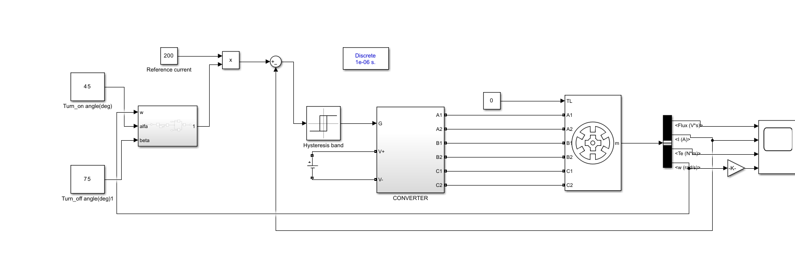

# Switched Reluctance Motor (SRM) Drive Simulation in MATLAB/Simulink

## Project Overview
This project presents the modeling and closed-loop control of a Switched Reluctance Motor (SRM) drive system designed for electric vehicle traction applications.

## Key Features & Control Architecture
* **Controller:** Hysteresis Current Controller for precise phase current regulation.
* **Power Electronics:** Asymmetric Bridge Converter topology for independent phase excitation and energy recovery.
* **Solver Configuration:** Discrete fixed-step solver (Sample time: 1e-6 s) optimized for high-frequency switching simulation.
* **Rotor Position Logic:** Turn-on and Turn-off angle commutation based on rotor position feedback.

## Simulink Model Architecture

## Parameters & Initialization

## How to Run
1. Open MATLAB (R2024b or later with Simscape Electrical).
2. Ensure parameters from `init_params.m.png` are loaded in the MATLAB Workspace.
3. Open and run `SRM_Drive_Model.slx`.
4.
